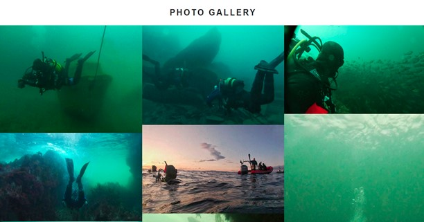

# Portfolio-Project1
## Portfolio Project 1-Irish Dive Sites Website
### This website was built as portfolio project one in the diploma in software development at the code institute. The site is designed for Irish divers to view shore dive locations and details on these dives throughout Ireland. 
### Lisa Butler

## **[Live Site] (https://lisa-butler.github.io/Portfolio-Project1/index.html)**

------------------------------------------------------------------

## **[Repository](https://github.com/lisa-butler/portfolio-project1)**

------------------------------------------------------------------

## Contnets

 1. [User Experience](#ux)
 2. [Website Features](#features)   
 3. [Technology Used](#tech) 
 4. [Testing](#testing)  
 5. [Bugs](#bugs)  
 6. [Deployment](#deploy)
 7. [Credits](#credits)
 8. [Content](#content)  

## User Experience 

### **Pre project planning** 

Before starting this project, I considered several options, ultimately landing on the concept of a shore dive database site as this is something Ireland does not have. I also have a passion for diving and a range of dive sites and images from them that I could use for my project.
I explored other diving websites in Ireland, such as diving.ie for ideas for color theme and structure.
For the purpose of this project, I chose to include just seven of potentially hundreds of sites in order to demonstrate the nature of the site within the time frame of the project creation.

**Strategy:**
Determining the best approach meant investigating the needs of the potential users. This included the needs of the divers looking for a dive site and those of potential contributors to the website.

**User stories:**
As a diver:
I was to be able to find dive sites in Ireland.
I want to be able to narrow my search by county.
I want to know the depth range at this site.
I want to know specific interests in this site.
I want to know how to access this site.
I want to know what level of diver skill this dive requires.
I want to know how to dive this site.
I want to know when the best time to dive this site is.

As a contributor:
I want to be able to access an index of dives and see if my site has already been added.
I want to be able to contact the page administrators to submit a new site.
I want to access information about dives.
I want to know when my site is added or when new sites are added by my peers.

**Scope:**
The website should have a clear and consistent layout including navigation and social media links.
The website should be accessible on all devices for divers to access on the go.
The home page of the website should include a welcome message explaining to users the purpose of the website and directing them towards the content.
The website should provide an easily navigable list of dive sites with a method of narrowing down sites by location.
Each dive site write up should contain enough information for a diver to find the site and successfully dive it. 
Images and videos should be included to showcase shore diving in Ireland.
The dive site information should be easy to interpret.
There should be a method for contributors to contact the website administrators.

### **Structural planning**

In order for the website to achieve these goals it was decided to have four pages; Home, Dive Sites, Media and Contact.

**Home:**
This page should contain an overview of what the purpose of the site is.
The navigation bar should be clear and easy to access.
An image banner should display diving related imagery.
A prompt to take the diver to the dive sites and a prompt to get in contact should be present.
Social media links should also feature.

**Dive Sites:**
This page should contain the same theme as the other pages.
There should be a dropdown menu to jump to sites by location.
Sites should be arranged by location and kept within groupings.
Each site should be clearly separate from the next and should contain all required information.
Media should be used to improve the user experience.
A return to top button should be available at the bottom of the page to stop the user from having to scroll back to the top.

**Media:**
This page should contain the same theme as the other pages.
This page should display images from irish shore dives as well as video content.
Content should be accessible on the site and via youtube. 
Video content should not autoplay.

**Contact:**
This page should contain the same media theme as the other pages.
This page should provide a form that a user can fill in to leave a comment or to contribute to the website.
The form should have a section to write a longer comment.
The form should have elements such as name and email as required.
The form should provide the user with an option to register to receive notifications when new sites are added.
The form send button should have a message that confirms the form has been submitted when clicked.

**Wireframes:**
A homepage wireframe was used to form a basic idea of the proposed layout of the site homepage.
The basic plan for the site was to keep it as uncluttered and minimalistic as possible while providing the required information in a concise manner. As the mean age of divers is generally older, it was intended that the site being as intuitive as possible.

### **Style**

Background: It was decided after some deliberation not to have a background image running behind the content as this was both distracting and made the content look more cluttered. The decision to leave the background color as white happed towards the end of the design phase when the content had been style and it was decided that this was the most minimalistic and legible approach.

**Color:** 
The white background was chosen as it enabled the content to be very legible and to stand out for the user, making the site more navigatable.

The colors eventually selected for use were;

* White #FFF -used for the background.
* Grey #D3D3D3 -used for hover over functions and detailing.
* Teal #008080 -used for heading, sub-headings and buttons.
* Black #000 -used for text as black on white is widely known as the most legible combination of colors.

The white background helped the banner images and images in the gallery page to pop out as well as heightening the pop of color in the icon used.

**Fonts:**
Fonts were selected based on what was clear and easy to read as well as feeling like they were suited for a diving-based theme. 
The fonts chosen were;
	-Ubuntu
	-Sans-Serif
The focus of these fonts being to provide the information in a non-distracting manner that was viable for the visually impaired user or someone trying to use the site on a mobile device.

------------------------------------------------------------------

## Website Features

### **Index.html**

The navigation bar: This is a simple and basic list of the four pages within the site. As seen below, the active page is depicted with a line underneath, while a mouseover changes the color to teal indicating it is ready to be clicked on. Inspiration was taken from the code institutes Love Running walkthrough project as I liked the simplicity of the design and the theme fitted well with my website plan.

**Icon:**
The top icon was used throughout the page to provide a page break between the navigation bar and the start of the content. This is a simple and aesthetically pleasing symbol that reiterated the theme of the page. Initially I did not include this image but felt there was very little tying each page together until it was added. The round shape contrasts well with the otherwise quite blocky theme of the website.

**Banner images:** 
This trio of images was chosen to form the banner instead of using a single image as they worked well together and provided an appealing insight into the websites theme. The link box displayed on-top of the images invites the used to explore further by following the link. This link will take the user to the dive sites page.

**Contact link:** 
This section is here to take the user directly to the contact form. By clicking contact us here the user gets transported to the contact page where they can fill out the form.
This is intended to guide the user through the site. 
The flow of this page means that a user looking for dive sites will be redirected to the dive sites page by the find out more button. A user looking to get in contact can click the get in contact link and find the contact form, allowing for a smooth progression through the site.

**Footer:** 
The footer contains links to various social media; Facebook, Twitter, YouTube and Instagram. 
These links are done using Font Awesome icons for aesthetic purposes and to keep the site looking clean and minimal. This theme was again taken from the Love Running walkthrough as it was simple and efficient.

### **dive-sites.html**

**The dropdown menu:**
This was added after deciding to remove the original second navigation bar that was being used to display the counties breakdown of dive sites. The color code is within keeping with the website theme and allows the user quick access to the county they would like to dive in.

 

The drop-down menu is teal in color and turns grey on mouse over, the selected dive site is shown with a light grey background. A walkthrough on how to create this dropdown was found on freecodecamp.org.

**The dive card:**
Each dive is placed on a card, this card shows a shadow as it is moused over, a simple asthetilly pleasing feature that makes the card appear lifted out from the page. The dive details are displayed within. This feaure was found on W3 schools and sample code altered and used here.

A Font Awesome icon was used to depict the dive site name. The important details are displayed along the top of the card, such as diver skill level and accessibility of the site as well as maximum depth. These are things divers look for when choosing a dive site and in a more developed version of the website would be options a user could filter sites by.
A basic write up on the site allows the diver to gain enough knowledge on how to dive the site that they can execute the dive effectively. A google maps link shows the user the exact location for the site.
Return to top: A top of page button is provided at the bottom of the dive sites page as this could become quite a long list in a more developed website.
However, if the site was o be developed further, a choice to have separate pages for each county may be made to enable a better flow through the website and create a better user experience.

### **media.html**

**Photos section:**
This was done using a basic grid layout with three columns on a PC or laptop and two on mobile device or those less than 800px in width.
Other options were considered but eventually it was decided that this was the most aesthetically pleasing with the images being large enough to be viewed well by even visually impaired users on a PC or laptop. This is a similar theme to what was done in the Love Running walkthrough project as this struck me as a very aesthetic way to display images.

**Video section:**
This involved the embedded links to YouTube videos. Clicking on the videos allows the user to view the video within the website or by clicking the title the viewer can be taken to YouTube. 

The videos do not autoplay and play muted initially to provide a smooth user experience. Videos are displayed in rows of two on Pc or laptop and 1 on screens below 800px in width.

### **contact.html**

The banner images: The contact page features banner images in keeping with the theme of the home page. 
These images once again break up the text and make the page pleasing to the eye.
The contact form: The form enables the user to input their name and email as well as a message. These fields are all set as required. There is also radio buttons to allow the user to decide if they want to receive email alerts pertaining to the addition of new dive sites.

When the user clicks the Send Message button, it takes them to thankyou.html. This page cannot be accessed any other way, its only purpose is to inform the user that their message has been sent.

### **thankyou.html**

This page contains a link to the index.html, the home page to return the user to home. At present the “Send Message” button is just a link rather than an actual button on a form, this was due to the nature of the project site but would be different in a working site.

**Further features I would implement:**

If I was to get the opportunity to build this site again to become an actual live site, there are some changes that I would like to make.

* Dive sites: This is the page that I would like to make the most changes to. As there are many more than seven dive sites in Ireland, a continuous list would not be a very viable option. I would instead have a drop-down menu for each county and these links would take the user to separate pages with their own drop-down menus for each dive site.
* The main dive sites page would have a map with clickable pins depicting the sites that would link the user to the site.
* I would have a search option and the option to filter by depth, skill level, location etc.
* I was also considering the option of having a “comments” section for each dive to allow divers to make suggestions and leave comments about specific sites.
* Media: Media would be rearranged to allow for a write up about each image, ie. Location it was taken in, time of year, life that is shown etc. Videos would be the same.
* Contact page: There is no back end to the contact page, so for now, hitting “send message” just links the user to a thank you page with a link back to the home page. If this became a live site the thank you would ideally self-direct back to the home page after a certain time frame has passed.
* Other elements to change: A potential of having a user account option so that users could save dives they want to do, comment on d dives and possibly even a separate place to log dives.

------------------------------------------------------------------

## Technologies Used 

### **Languages** 

The languages used in this project were;

* HTML5
* CSS3

### **Frameworks/Libraries/programs:**

* Font Awesome: Used throughout the website for icons.
* Google Fonts: Ubuntu was used for the main content of the project, obtained through Google Fonts.
* GitHub: Used to store the project and to deploy the finished project.
* Fork: This was used as a local place to push code to and to pull from the Git repository.
* Brackets text editor: This was used to write the code locally.
* Bootstrap was considered but at too late a stage in the project.

------------------------------------------------------------------

## Troubleshooting and testing

### **Troubleshooting:**
Many of the issues that arouse and required troubleshooting were due to item positioning on the screen. This was an issue while creating the site initially and later when formatting the site to make it responsive for mobile devices. In retrospect, if I was creating this site gain, I would use grid throughout as a positioning tool. As it stands, I started by using Flexbox but consistently found it was not having the desired outcome and ultimately used Grid in the final stages of responsive design editing. 
Better planning before beginning development would be beneficial too. I would have liked to use Bootstrap to make the site more responsive.

### **Testing:**
Testing was mostly done by me and some friends, three of which are software developers, to determine the usability and functionality of the site.

**Testing links and forms:**
    
* Navigation links are working and bring the user to the correct page. Yes.
* The home page “Find out more here” link is working and tkes user to dive sites page. Yes.
* The “Contact us here” link on the homepage is working and takes user to the contact page. Yes.
* The social media links all work and take users to the correct social media. Yes.
* The dropdown menu options each link the user to the correct portion of the dive sites page. Yes.
* The google maps link for the dive site works for each site and takes user to the correct location on maps. Yes.
* The “Return to top” link at the bottom of the page brings the user back to the top of the dive sites page. Yes.
* The Youtube videos take the user to the correct video on Youtube when their title is clicked on. Yes.
* The “Send Message” button takes the user to the thankyou.html page when clicked on. 
* The “Return to site” button takes the user back to the home page of the site when clicked on.
    
**Testing other elements:** 
    
* Images were all present and viewable without any gaps. Yes.
* The videos played both embedded and in Youtube. Yes.
* The dive sites cards fitted the content and text was legible and formatted in an intuitive reading style. Yes.
* Navigation of the site was intuitive. Yes.
* The dive sites dropdown was clarly a dropdown. Changed to have a drop down symbol.

------------------------------------------------------------------

## Bugs

### **Bugs Found:**

* In the contact form, on mousing over the input boxes, they merged with the background and disappeared. This was solved by removing the hover function.
* Content on dive sites page was squashed together when on mobile view (screens less than 800px in width). Issue solved by rearranging image and text positioning.
* Cards on dive site page overlapping each other. Solved by positioning each card within a div.
* First name, last name and email address merging onto the same line in contact form. Solved by placing first and last name and email in separate divs.
* Sub menu for dive sites locations broken down into counties not aesthetically pleasing. Issue solved by using a dropdown menu.
* Many Font Awesome icons not displaying. Issue not solved so icons removed.
* Font Awesome icons not leaving space between icon and text. Issue solved by giving icon a class and giving this a margin.
* Contact form sitting to the left of the screen and refusing positioning attempts. Grid used to structure it.

------------------------------------------------------------------

## Deployment

* Deployment of the site via github was done using the following steps;
* After logging into GitHub I located my repository for my Portfolio Project 1. 
* I then clicked the "Settings" button at the top of my repository
* In settings I scrolled down until I found the "GitHub Pages" section which has a banner informing me that it now had its own section. I clicked the link and was taken to the pages section.
* Under "Source" option I clicked the dropdown called "None" and select "Master Branch".
* The page automatically refreshed.
* I was told that my site was deploying, and a link was displayed. After about a minute and a refresh there was a tick present next to the link and my site was deployed and live.

------------------------------------------------------------------

## Credits and Acknowledgements

### **Credits:**

* Images and Video: All image content used in this website was taken by Lisa Butler using a GoPro Hero 7.
* Icon: The icon image was free from istockphoto.com (https://www.istockphoto.com/).
* Code: Some code snippets were taken and adjusted for purpose from W3Schools (https://www.w3schools.com/), Stack Overflow (https://www.w3schools.com/) and FreeCodeCamp (https://www.freecodecamp.org/).
* Some code used in the Love Running Challenge was used and changed for purpose.

### **Acknowledgements:** 

* My mentor Gerard McBride for pointers and overall reviewing.
* My software developer friends (Joshua Butler-Overstock Ireland and Glenn Gilmartin-Overstock Ireland) for their advice and patience.
* My classmate Alan Bushell for advice and encouragement on website structuring and writing a README.

------------------------------------------------------------------

## Content and resources

 

* All content was written by the developer as part of an academic exercise for the Code Institute.
* All images and videos were taken by the developer using a GoPro Hero 7.
